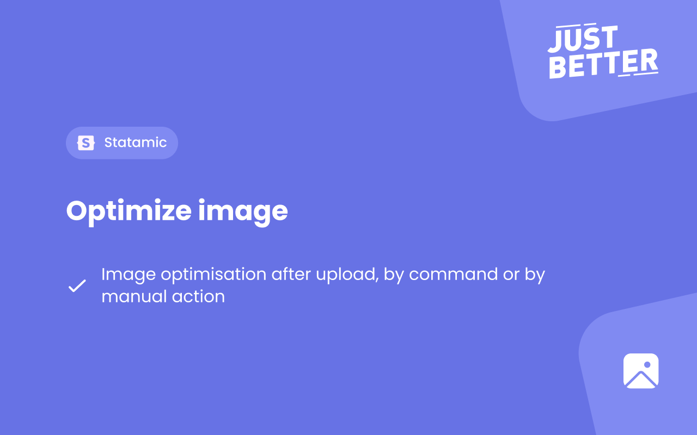

<a href="https://github.com/justbetter/statamic-image-optimize" title="JustBetter">
    
</a>

# Image Optimize

> Image optimization after upload

## How to Install

You can search for this addon in the `Tools > Addons` section of the Statamic control panel and click **install**, or run the following command from your project root:

``` bash
composer require justbetter/statamic-image-optimize
```

## Requirements
The addon makes use of batches to optimize the images.
Because of this you need an active Database connection that contains the `job_batches` table.
You can generate this table by running the following commands:

```
php artisan queue:batches-table
php artisan migrate
```

## Config

### Publish

```
php artisan vendor:publish --provider="JustBetter\ImageOptimize\ServiceProvider"
```

### Settings

It's possible to change to default resize width and height by overriding the config file and changing the parameters within.


## Commands
```
php artisan justbetter:optimize:images
```

By running this command you can recursively optimize all the images in the assets folder.

### Options

Add the `--forceAll` option to force the command to optimize all images. 
Otherwise the command will only optimize images that have not been optimized yet.

You can also use the verbose option by adding `-v` to your command, 
this will show a progress bar containing the amount of jobs left in the batch.

## Features

- After an image is uploaded an event will trigger to optimize the image.
The event optimizes the images and resizes it to a specified size, this is being controlled by the config file.

- By using the resize images command you can recursively optimize all the images in the assets folder.

- Added an action in the CP Asset overview that allows you to select assets and trigger the optimize job manually.
- Added an CP page to manually optimize all images, triggering this will show a progress bar containing the remaining images.
