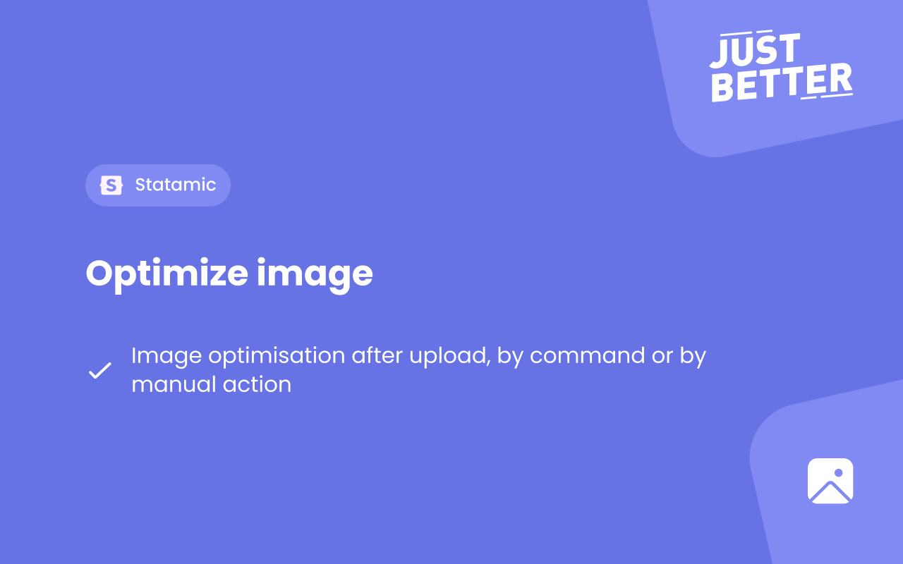

<a href="https://github.com/justbetter/statamic-image-optimize" title="JustBetter">
    
</a>

# Image Optimize

> Image optimization after upload

## How to Install

You can search for this addon in the `Tools > Addons` section of the Statamic control panel and click **install**, or run the following command from your project root:

```bash
composer require justbetter/statamic-image-optimize
```

## Requirements

The addon makes use of **Laravel Batches** to optimize images.
Because of this you need an active database connection that contains the `job_batches` table.
You can generate this table by running the following commands:

```bash
php artisan queue:batches-table
php artisan migrate
```

If your queue connection is not `sync`, make sure a queue worker is running.

## Config

### Publish

```bash
php artisan vendor:publish --provider="JustBetter\ImageOptimize\ServiceProvider"
```

### Settings

You can change the default resize width/height and queue settings in `config/image-optimize.php` (or via env vars like `IMAGE_OPTIMIZE_WIDTH`, `IMAGE_OPTIMIZE_HEIGHT`, `IMAGE_OPTIMIZE_QUEUE_CONNECTION`, `IMAGE_OPTIMIZE_QUEUE_NAME`).

## Commands

```bash
php artisan justbetter:optimize:images
```

By running this command you can optimize images in the Statamic asset library.

### Options

Add the `--forceAll` option to force the command to optimize all images. 
Otherwise the command will only optimize images that have not been optimized yet.

You can also use the verbose option by adding `-v` to your command, 
this will show a progress bar containing the amount of jobs left in the batch.

## Features

- After an image is uploaded an event will trigger to optimize the image.
The event optimizes the images and resizes it to a specified size, this is being controlled by the config file.
- By using the optimize images command you can optimize images in the asset library.
- Added an action in the CP Asset overview that allows you to select assets and trigger the optimize job manually.
- Added a CP page to optimize remaining images or force-optimize all images, showing batch progress while it runs.

